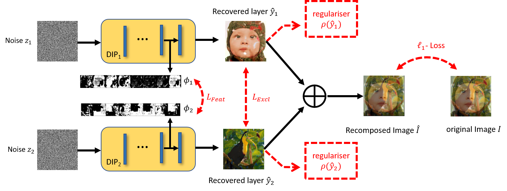

# BITS-NET: BLIND IMAGE TRANSPARENCY SEPARATION NETWORK
Official pytorch implementation of the paper "**[BITS-NET: BLIND IMAGE TRANSPARENCY SEPARATION NETWORK]()**" (ICIP'2023).



# Citing
If this code is helpful to you, please cite:
## BibTex
```
@INPROCEEDINGS{
  
}

```